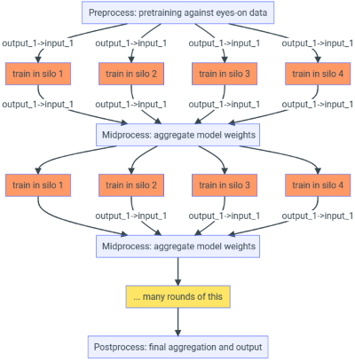

## Why should you consider Federated Learning?

Let's take the example of a data scientist working in a hospital to classify medical images to detect a specific patient condition. The team at the hospital _already_ has a deep learning model trained in a centralized fashion with their own patient data. The model achieved reasonable performance. Now the hospital wants to further improve the model's performance by partnering with other hospitals. Federated Learning will enable them to collaborate on the model training while keeping control of the hospital's own data, complying with their local regulations and privacy obligations, while enabling better quality models for the benefit of their patients.

Federated Learning (FL) is a framework where one trains a single ML model on distinct datasets that cannot be gathered in a single central location. The basic idea of FL is to train a model by aggregating the results of N isolated training jobs, each running on separated computes with restricted access to given data storages.

The training is orchestrated between a central server (_a.k.a._ orchestrator) and multiple clients (_a.k.a._ silos or embassies). The actual model training happens locally inside the silos/clients on their respective data, without the data ever leaving their respective trust boundaries. Only the local models are sent back to the central server/orchestrator for aggregation.

When the computes and data are in the cloud, we say they live in silos, and cross-silo federated learning consists in orchestrating the training and aggregation jobs against the cloud provider. The following figure illustrates what a federated learning solution looks like.

Creating such a graph of jobs can be complex. This repository provides a recipe to help.

## How to plan for your Federated Learning project

We wrote a generic guide on how to get started, ramp-up and mature your [FL project](./concepts/plan-your-fl-project.md).
